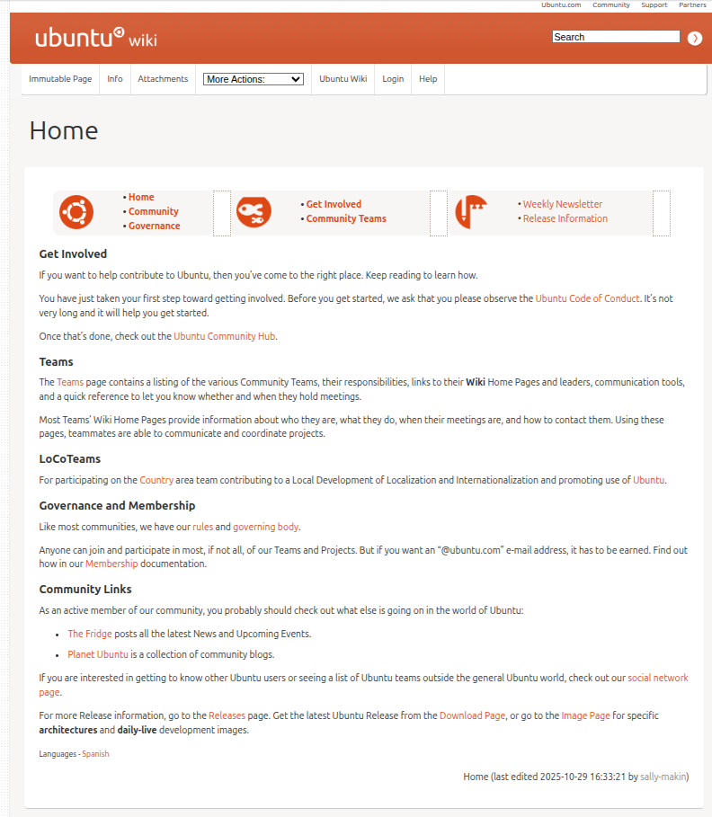
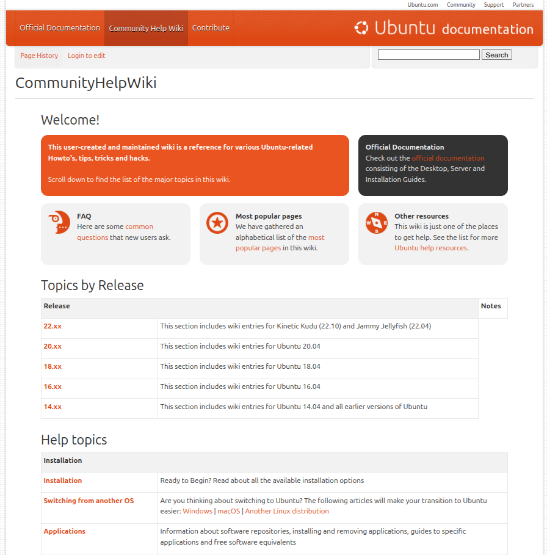
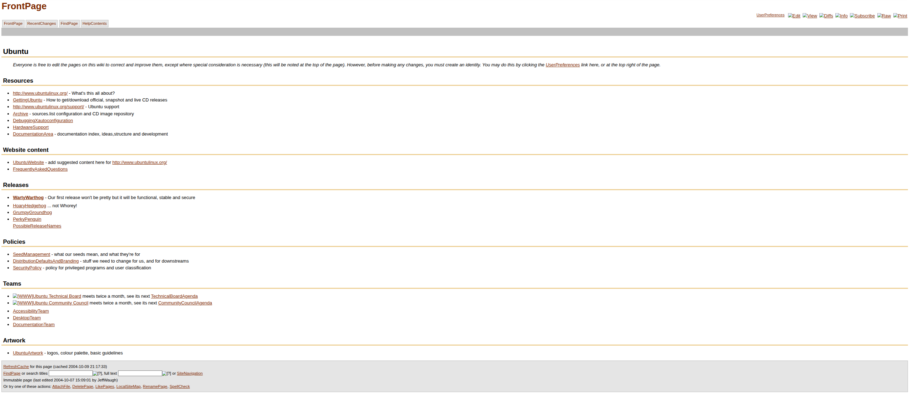
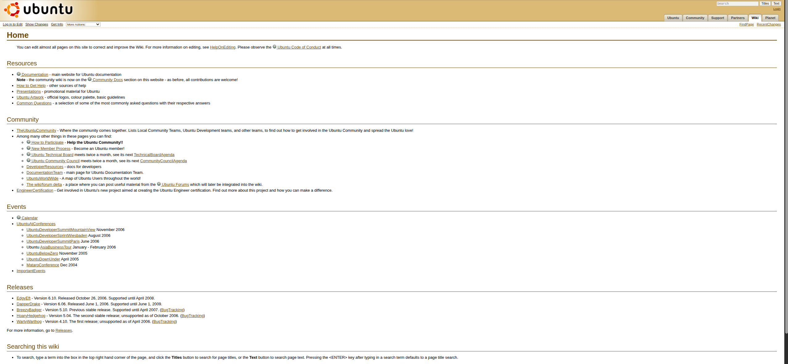
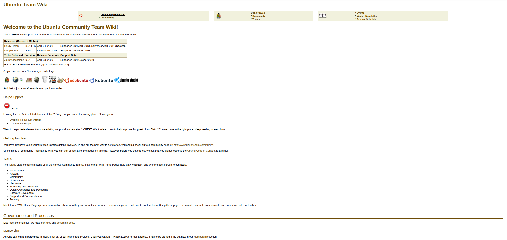
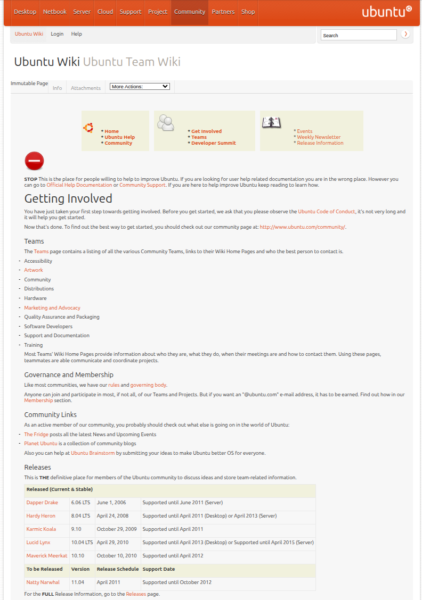
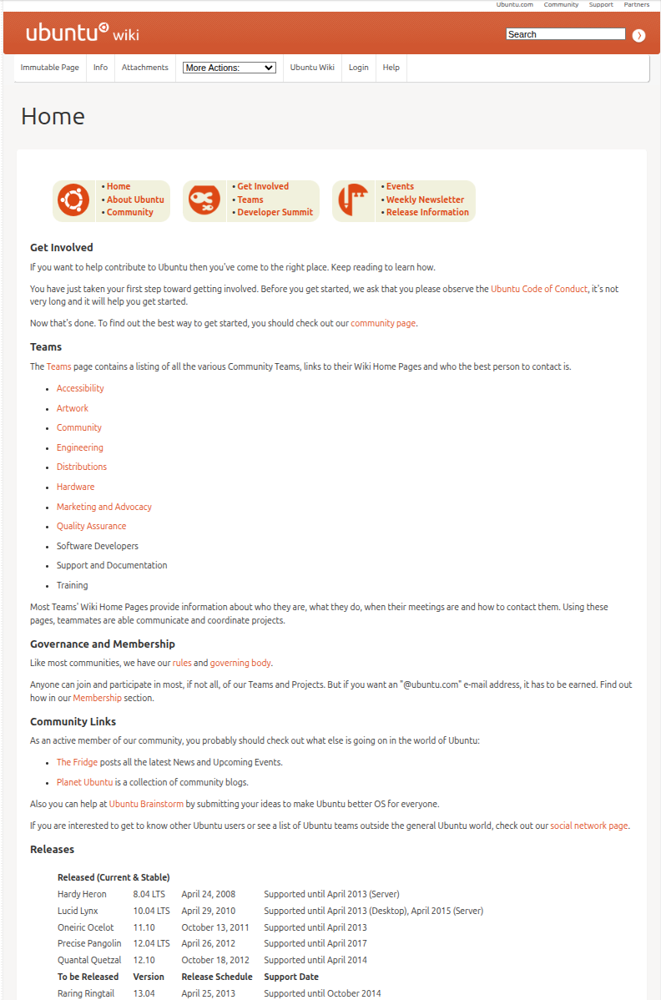
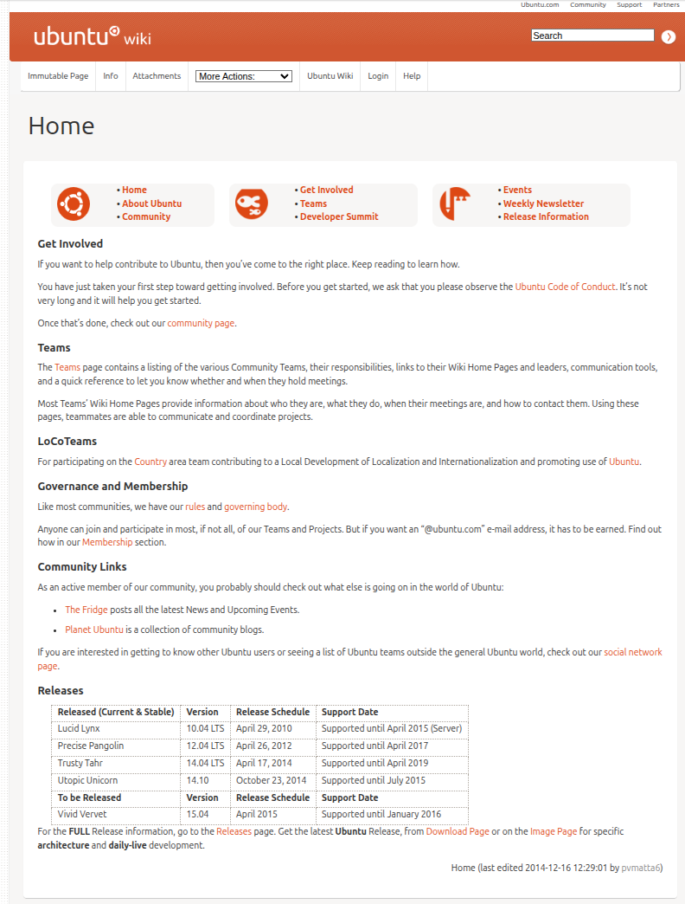

# Archive of Ubuntu wikis (2004-2026)

This is a public, readonly archive of the source text for two deprecated Ubuntu wikis:

- **UbuntuWiki**: archived from `wiki.ubuntu.com`
- **UbuntuCommunityHelpWiki**: archived from `help.ubuntu.com/community/CommunityHelpWiki`

As these wikis were very large, we sorted each into alphanumeric subdirectories,
to improve search and navigation on GitHub.

Tarballs are also available as release assets. These contain multiple page
versions, images, attachments, and other data that could not be included in the
repository directly.

## Purpose of these archives

These archives are intended to serve two purposes:

1. Preserve an important part of Ubuntu history in a way that's easy to access
1. Make pages available to contributors and teams who may need to copy,
   download, or migrate them

## Limitations of the text-based archive

1. We have needed to remove content, including images, attachments and versions, to reduce space requirements.
1. To make the pages more readable on GitHub, we have converted the markup to MediaWiki style. This
conversion is not perfect, and you may encounter formatting and rendering errors.
1. This archive is not intended to be used for general reference or to be maintained with working links. Most links are wrapped in `<nowiki>` tags and will not work.
1. The index for the larger wiki is too long for GitHub to render fully. To view the complete index, you must view the `raw` file. In a local copy, you can use the index for navigating to the files; for example, using `g f` in Vim.

If 1 and 2 are a problem, use the tarballs provided as release assets.

## Suitable for most use-cases: text-only wiki archives

The original wikis were built using the Moinmoin wiki engine.
To make archives that were readable and searchable on GitHub, the following modifications were made:

1. Removed any files that were empty, stubs, or that contained spam
1. Removed any version of a page that wasn't the latest version
1. Removed named parent folders for pages and transferred the name to the relevant file
1. Removed URL encoding from filenames
1. Converted Moinmoin wiki syntax to MediaWiki syntax, which renders on GitHub
1. Added a top-level warning to all pages about limitations of the wiki
1. Sorted pages in each wiki into alphanumeric folders (GitHub truncates long lists of files)

## For the completionists: wiki tarballs

Compressed tarballs of the wikis are available as GitHub release assets.

These include images, attachments, and page versions.
The source pages are unmodified, so they use Moinmoin syntax.

The `Community Help Wiki` is provided as a single tarball.

The `wiki.ubuntu.com` archive exceeds the GitHub asset limit by an order of
magnitude. For this reason, the tarball is split into smaller parts, which can
be re-assembled before extraction.

## Gallery

### The two wikis in 2026

#### wiki.ubuntu.com

#### Community wiki

### wiki.ubuntu.com through the ages

#### 2004

#### 2006

#### 2008

#### 2010

#### 2012

#### 2014

#### 2026

